# Taller_2_-3
# ¡PYTHON FC!
<details>
  <summary>DORSAL 9</summary>
  Said Kaled Ibrahim Essa-Allahu Akbar
</details>
<details>
  <summary>DORSAL 10</summary>
  Luis Alejandro Rojas Guillén-Rinitis Aguda
</details>
<details>
  <summary>DORSAL 11</summary>
  Daniel Garzón Cuasquen-El Hacker
</details>

<details>
  <summary>¡ESCUDO!</summary>
  
  [](https://postimg.cc/jnSDC96C)

</details>

<details>
  <summary>Con la elegancia de siempre sabernos...</summary>
  
>  ...SANGRE FRIA
  
</details>

# 1

```mermaid

flowchart TD
    A(("Inicio")) --> B["Función digitos(num)"]
    B --> C["Inicializar lista"]
    C --> D{"num > 0?"}
    D -->|Sí| E["Obtener último dígito"]
    E --> F["Añadir dígito a la lista"]
    F --> G["Reducir num"]
    G --> D
    D -->|No| H["Retornar lista"]
    H --> I(("Entrada del usuario"))
    I --> J["Llamar función digitos(num)"]
    J --> K["Invertir lista"]
    K --> L["Imprimir dígitos"]
    L --> M(("Fin"))

```

```ruby
#1
def digitos(num: int) -> list:
    """
    Separa los dígitos de un número entero y los devuelve como una lista.

    Parámetros:
    num (int): El número entero del cual se quiere separar los dígitos.

    Retorna:
    list: Una lista de los dígitos separados del número.
    """
    digitos_separados = []  # Lista que almacenará los dígitos separados del número
    while num > 0:
        # Obtiene el dígito más a la derecha usando el operador módulo
        digito = num % 10
        # Añade el dígito a la lista
        digitos_separados.append(digito)
        # Reduce el número eliminando el dígito más a la derecha
        num //= 10
    return digitos_separados  # Devuelve la lista de dígitos separados

if __name__ == "__main__":
    # Solicita al usuario que ingrese un número entero
    num = int(input("Digite un número entero: "))
    
    # Separa los dígitos del número ingresado
    digitos_separados = digitos(num)
    
    # Invierte el orden de los dígitos para mostrarlos en el orden correcto
    digitos_separados.reverse()
    
    # Imprime los dígitos separados en el orden original
    print(f"Los dígitos separados de {num} son \n{digitos_separados}")
```

<details>
  <summary>Explicacion</summary>
  Proceso:
  Inicialización: Se crea una lista vacía llamada digitos_separados para almacenar los dígitos extraídos.
  Extracción de Dígitos: Se utiliza un bucle while que continúa ejecutándose mientras el número sea mayor que 0:
  Obtención del Dígito: Se obtiene el dígito más a la derecha del número usando num % 10 (operador módulo).
  Adición a la Lista: El dígito obtenido se agrega a la lista digitos_separados.
  Eliminación del Dígito: Se reduce el número eliminando el dígito más a la derecha usando num //= 10 (división entera).
  Retorno: La lista digitos_separados, que contiene los dígitos en orden inverso, se devuelve.
</details>

# 2

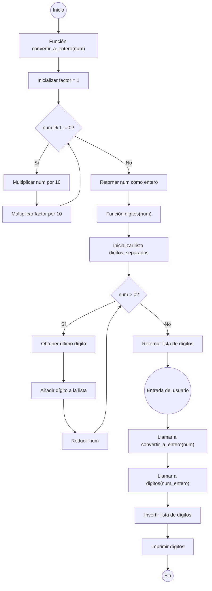

```ruby
# Función para convertir un número racional a un número entero
def convertir_a_entero(num: float) -> int:
    """
    Convierte un número racional (con decimales) a un número entero al eliminar el punto decimal.
    
    Parámetros:
    num (float): El número racional que se desea convertir a entero.

    Retorna:
    int: El número convertido a entero, sin parte decimal.
    """
    factor = 1  # Inicializa el factor que se usará para multiplicar y eliminar la parte decimal
    while num % 1 != 0:
        # Multiplica el número por 10 hasta que no tenga parte decimal
        num *= 10
        factor *= 10  # Actualiza el factor de multiplicación
    return int(num)  # Convierte y retorna el número como un entero

def digitos(num: int) -> list:
    """
    Separa los dígitos de un número entero y los devuelve como una lista.

    Parámetros:
    num (int): El número entero del cual se quiere separar los dígitos.

    Retorna:
    list: Una lista de los dígitos separados del número.
    """
    digitos_separados = []  # Lista para almacenar los dígitos separados
    while num > 0:
        # Obtiene el dígito más a la derecha usando el operador módulo
        digito = num % 10
        # Añade el dígito a la lista
        digitos_separados.append(digito)
        # Elimina el dígito más a la derecha del número
        num //= 10
    return digitos_separados  # Devuelve la lista de dígitos separados

if __name__ == "__main__":
    # Solicita al usuario que ingrese un número racional (con decimales)
    num = float(input("Digite un número racional: "))
    
    # Convierte el número racional a un número entero (eliminando los decimales)
    num_entero = convertir_a_entero(num)
    
    # Separa los dígitos del número entero obtenido
    digitos_separados = digitos(num_entero)
    
    # Invierte el orden de los dígitos para mostrarlos en el orden correcto
    digitos_separados.reverse()
    
    # Imprime los dígitos separados en el orden original
    print(f"Los dígitos separados de {num_entero} son \n{digitos_separados}")

```

<details>
  <summary>Explicacion</summary>
  Ingreso de Datos: El usuario ingresa un número decimal.
  Conversión a Entero: El número decimal se convierte en entero eliminando los decimales.
  Separación de Dígitos: Los dígitos del número entero se separan y almacenan en una lista.
  Inversión de Orden: La lista de dígitos se invierte.
  Impresión: Se muestra la lista de dígitos en el orden correcto.
</details>

# 3
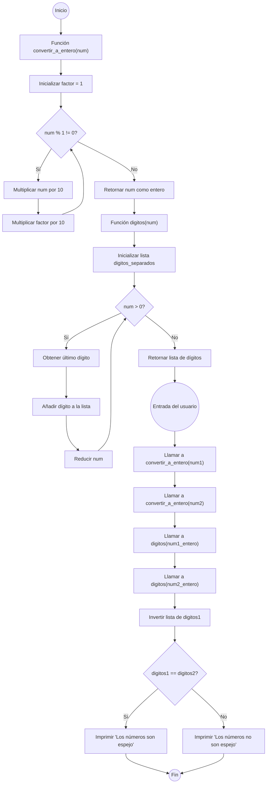

```ruby
def convertir_a_entero(num: float) -> int:
    """
    Convierte un número racional (con decimales) a un número entero al eliminar el punto decimal.
    
    Parámetros:
    num (float): El número racional que se desea convertir a entero.

    Retorna:
    int: El número convertido a entero, sin parte decimal.
    """
    factor = 1  # Inicializa el factor que se usará para multiplicar y eliminar la parte decimal
    while num % 1 != 0:
        # Multiplica el número por 10 hasta que no tenga parte decimal
        num *= 10
        factor *= 10  # Actualiza el factor de multiplicación
    return int(num)  # Convierte y retorna el número como un entero

def digitos(num: int) -> list:
    """
    Separa los dígitos de un número entero y los devuelve como una lista.

    Parámetros:
    num (int): El número entero del cual se quiere separar los dígitos.

    Retorna:
    list: Una lista de los dígitos separados del número.
    """
    digitos_separados = []  # Lista para almacenar los dígitos separados
    while num > 0:
        # Obtiene el dígito más a la derecha usando el operador módulo
        digito = num % 10
        # Añade el dígito a la lista
        digitos_separados.append(digito)
        # Elimina el dígito más a la derecha del número
        num //= 10
    return digitos_separados  # Devuelve la lista de dígitos separados

if __name__ == "__main__":
    # Solicita al usuario que ingrese dos números racionales (con decimales)
    num1 = float(input("Digite el primer número: "))
    num2 = float(input("Digite el segundo número: "))
    
    # Convierte los números racionales a enteros (eliminando los decimales)
    num1_entero = convertir_a_entero(num1)
    num2_entero = convertir_a_entero(num2)
    
    # Separa los dígitos de ambos números enteros obtenidos
    digitos1 = digitos(num1_entero)
    digitos2 = digitos(num2_entero)
    
    # Invierte el orden de los dígitos del primer número para verificar si son espejos
    digitos1.reverse()

    # Compara las listas de dígitos; si son iguales, los números son espejos
    if digitos1 == digitos2:
        print("Los números son espejo")
    else:
        print("Los números no son espejo")

```

<details>
  <summary>Explicacion</summary>
  Ingreso de Datos: El usuario introduce dos números con decimales.
  Conversión: Los números con decimales se convierten en enteros eliminando la parte decimal.
  Separación de Dígitos: Los dígitos de los números enteros se extraen y se almacenan en listas.
  Inversión: La lista de dígitos del primer número se invierte.
  Comparación: Se verifica si la lista invertida del primer número es igual a la lista de dígitos del segundo número. El resultado se imprime para indicar si los números son espejos o no.
</details>

# 4
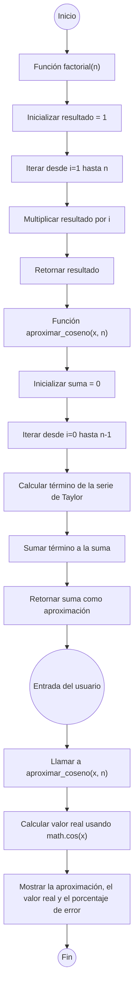

```ruby
import math  # Importamos la librería math para usar la función coseno y otras utilidades matemáticas

def aproximar_coseno(x, n):
    """
    Calcula la aproximación del coseno de x usando la serie de Taylor.
    
    Parámetros:
    x (float): El ángulo en radianes para el cual se quiere calcular el coseno.
    n (int): El número de términos de la serie de Taylor a utilizar en la aproximación.
    
    Retorna:
    float: La aproximación del coseno de x.
    """
    suma = 0  # Inicializa la suma que acumulará los términos de la serie
    for i in range(n):
        # Calcula cada término de la serie de Taylor para el coseno
        termino = ((-1) ** i) * (x ** (2 * i)) / factorial(2 * i)
        suma += termino  # Suma el término calculado a la acumulada
    return suma  # Devuelve la suma como la aproximación final del coseno

def factorial(n: int) -> int:
    """
    Calcula el factorial de un número entero n.
    
    Parámetros:
    n (int): Número entero no negativo cuyo factorial se desea calcular.
    
    Retorna:
    int: El factorial de n.
    """
    resultado = 1  # Inicializa el resultado del factorial
    for i in range(1, n + 1):
        resultado *= i  # Multiplica el acumulado por el valor actual de i
    return resultado  # Devuelve el factorial de n

if __name__ == "__main__":
    # Solicita al usuario que ingrese el valor de x y el número de términos n para la aproximación
    x = float(input("Ingrese el valor de x para calcular Cos(x): "))
    n = int(input("Ingrese el numero de terminos de la serie: "))
    
    # Calcula la aproximación del coseno usando la serie de Taylor con los valores ingresados
    aproximacion = aproximar_coseno(x, n)
    
    # Calcula el valor real del coseno utilizando la función de la librería math
    valor_real = math.cos(x)
    
    # Muestra la aproximación calculada, el valor real y el porcentaje de error
    print(f"Aproximacion de Cos({x}) usando {n} terminos: {aproximacion}")
    print(f"Valor real de Cos({x}): {valor_real}")
    print(f"Porcentaje de error: {((abs(valor_real - aproximacion) / valor_real) * 100):.2f} %")
```

<details>
  <summary>Explicacion</summary>
  Proceso:
  Inicializa una variable suma en 0 para acumular el valor de la serie.
  Usa un bucle para calcular y sumar cada término de la serie de Taylor.
  Cada término de la serie se calcula con la fórmula 
  ((−1)∗∗𝑖)∗(𝑥∗∗(2∗𝑖))/𝑓𝑎𝑐𝑡𝑜𝑟𝑖𝑎𝑙(2∗𝑖)((−1)∗∗i)∗(x∗∗(2∗i))/factorial(2∗i), donde i es el índice del término.
  Llama a la función factorial para obtener el factorial del denominador.
  Retorna: La suma acumulada de todos los términos, que es la aproximación del coseno.
</details>

# 5

# Sin usar el algoritmo de euclides
```ruby
def mcm(a: int, b: int) -> int:
    """
    Calcula el mínimo común múltiplo (MCM) de dos números enteros.

    Parámetros:
    a (int): El primer número entero.
    b (int): El segundo número entero.

    Retorna:
    int: El mínimo común múltiplo de a y b.
    """
    multiplo = a  # Inicializa el múltiplo en el valor de 'a'
    
    while True:
        # Verifica si el múltiplo actual es divisible por 'b'
        if multiplo % b == 0:
            return multiplo  # Si lo es, este es el MCM y se retorna
        multiplo += a  # Si no, incrementa el múltiplo en 'a' y repite el proceso

if __name__ == "__main__":
    # Solicita al usuario que ingrese dos números enteros
    a = int(input("Ingrese el primer número: "))
    b = int(input("Ingrese el segundo número: "))
    
    # Calcula el MCM de los dos números ingresados
    minimo_comun_multiplo = mcm(a, b)
    
    # Imprime el resultado
    print(f"El MCM de {a} y {b} es: {minimo_comun_multiplo}")
```
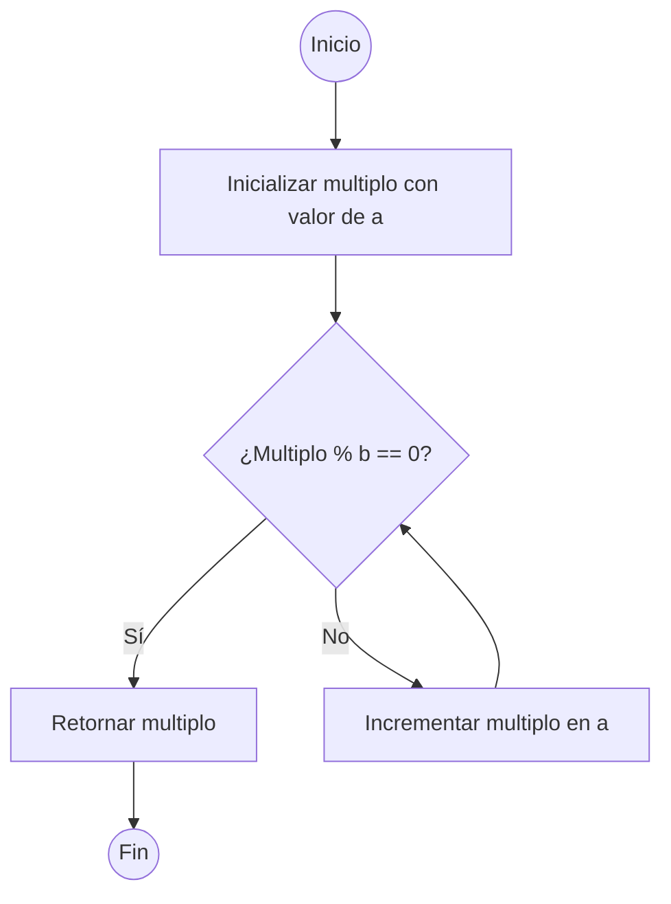
<details>
  <summary>Explicacion</summary>
  Inicialización: Empieza con el múltiplo inicial en a.
  Iteración: Entra en un bucle infinito y verifica si el múltiplo actual es divisible por b.
  Condición de Éxito: Si es divisible (multiplo % b == 0), retorna el múltiplo como el MCM.
  Incremento: Si no es divisible, incrementa el múltiplo en a y repite la verificación.
</details>
  

# Usando el algoritmo de euclides
```ruby
def mcd(a: int, b: int) -> int:
    """
    Calcula el máximo común divisor (MCD) de dos números enteros utilizando el algoritmo de Euclides.

    Parámetros:
    a (int): Primer número entero.
    b (int): Segundo número entero.

    Retorna:
    int: El máximo común divisor de a y b.
    """
    while b != 0:  # Mientras b no sea 0
        a, b = b, a % b  # Actualiza a con b y b con el residuo de a dividido por b
    return abs(a)  # Retorna el valor absoluto de a (el MCD siempre es positivo)

def mcm(a: int, b: int) -> int:
    """
    Calcula el mínimo común múltiplo (MCM) de dos números enteros utilizando el MCD.

    Parámetros:
    a (int): Primer número entero.
    b (int): Segundo número entero.

    Retorna:
    int: El mínimo común múltiplo de a y b.
    """
    return abs(a * b) // mcd(a, b)  # Usa la relación MCM(a, b) = abs(a * b) // MCD(a, b)

if __name__ == "__main__":
    # Solicita al usuario que ingrese dos números enteros
    num1 = int(input("Ingrese el primer numero: "))
    num2 = int(input("Ingrese el segundo numero: "))

    # Calcula el MCD y MCM de los dos números ingresados
    maximo_comun_divisor_resultado = mcd(num1, num2)
    minimo_comun_multiplo_resultado = mcm(num1, num2)

    # Imprime los resultados
    print(f"El MCM de {num1} y {num2} es: {minimo_comun_multiplo_resultado}")
```
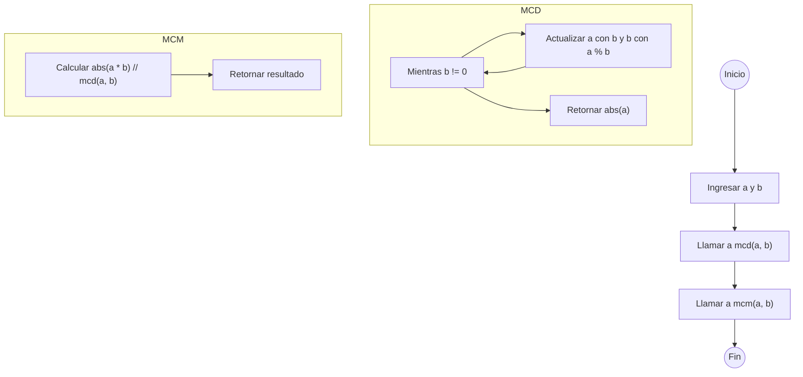
<details>
  <summary>Explicacion</summary>
  Algoritmo de Euclides: Utiliza un enfoque basado en la división sucesiva.
  Iteración: Reemplaza a con b y b con el residuo de a dividido por b hasta que b sea 0.
  Resultado: Cuando b es 0, a contiene el MCD, que se retorna.
</details>
  

# Usando funciones recursivas
```ruby
def mcd(a: int, b: int) -> int:
    """
    Calcula el máximo común divisor (MCD) de dos números enteros usando recursión y el algoritmo de Euclides.

    Parámetros:
    a (int): El primer número entero.
    b (int): El segundo número entero.

    Retorna:
    int: El máximo común divisor de a y b.
    """
    if b == 0:
        return a  # Caso base: si b es 0, el MCD es a
    else:
        # Llamada recursiva intercambiando los parámetros
        return mcd(b, a % b)

def mcm(a: int, b: int) -> int:
    """
    Calcula el mínimo común múltiplo (MCM) de dos números enteros.

    Parámetros:
    a (int): El primer número entero.
    b (int): El segundo número entero.

    Retorna:
    int: El mínimo común múltiplo de a y b.
    """
    return (a * b) // mcd(a, b)  # Usa la fórmula MCM(a, b) = (a * b) / MCD(a, b)

if __name__ == "__main__":
    # Solicita al usuario que ingrese dos números enteros
    a = int(input("Ingrese el primer número: "))
    b = int(input("Ingrese el segundo número: "))
    
    # Calcula el MCD y el MCM de los dos números ingresados
    maximo_comun_divisor_resultado = mcd(a, b)
    minimo_comun_multiplo_resultado = mcm(a, b)
    
    # Imprime el resultado del MCM
    print(f"El MCM de {a} y {b} es: {minimo_comun_multiplo_resultado}")

```
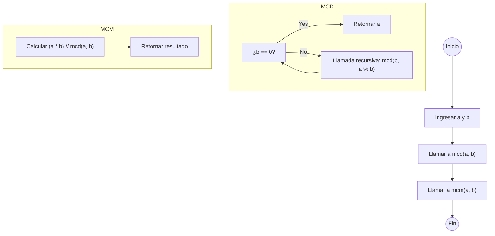
<details>
  <summary>Explicacion</summary>
  Método: Utiliza el MCD calculado por la función mcd. La relación entre el MCM y el MCD es:
  Fórmula: 
  MCM(a,b)= ∣a×b∣ / MCD(a,b)
  Proceso: Multiplica los dos números y divide el resultado por su MCD. Esto asegura que el resultado sea el menor número que es múltiplo común de ambos números.
  Proceso: Primero, se calcula el MCD usando la función mcd, y luego se usa este MCD para calcular el MCM.
</details>
  

# 6
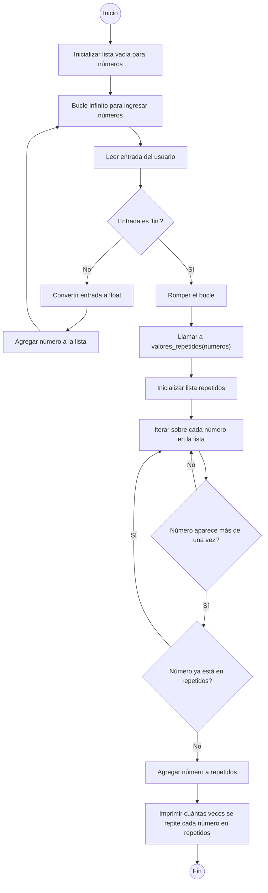

```ruby
def valores_repetidos(numeros: list) -> list:
    """
    Encuentra y retorna los valores que se repiten en una lista.

    Parámetros:
    numeros (list): Una lista de números.

    Retorna:
    list: Una lista de números que se repiten en la lista original.
    """
    repetidos = []  # Lista para almacenar los números repetidos

    # Itera sobre cada número en la lista original
    for i in numeros:
        # Verifica si el número aparece más de una vez en la lista
        if numeros.count(i) > 1:
            # Si el número no está ya en la lista de repetidos, lo agrega
            if i not in repetidos:
                repetidos.append(i)
                
    return repetidos  # Retorna la lista de números repetidos

if __name__ == "__main__":
    numeros = []  # Inicializa una lista vacía para almacenar los números ingresados por el usuario
    
    # Bucle infinito para ingresar números en la lista
    while True:
        entrada = input("Digite el número que quiere ingresar a la lista, para terminar, ingrese 'fin': ")
        if entrada.lower() == "fin":  # Verifica si el usuario desea finalizar la entrada de números
            break
        numeros.append(float(entrada))  # Convierte la entrada a float y la agrega a la lista
    
    # Llama a la función para obtener los números repetidos en la lista
    repetidos = valores_repetidos(numeros)

    # Itera sobre la lista de números repetidos e imprime cuántas veces se repite cada número
    for i in repetidos:
        print(f"El número {i} se repite {numeros.count(i)} veces.")
```

<details>
  <summary>Explicacion</summary>
  Proceso:
  Inicializa una lista vacía repetidos para almacenar los números que se repiten.
  Itera sobre cada número en la lista:
  Usa numeros.count(i) para contar cuántas veces aparece el número i en la lista.
  Si el número aparece más de una vez y no está ya en la lista repetidos, se añade a esta lista.
  Retorna: La lista repetidos con los números que se repiten.
</details>

# 7
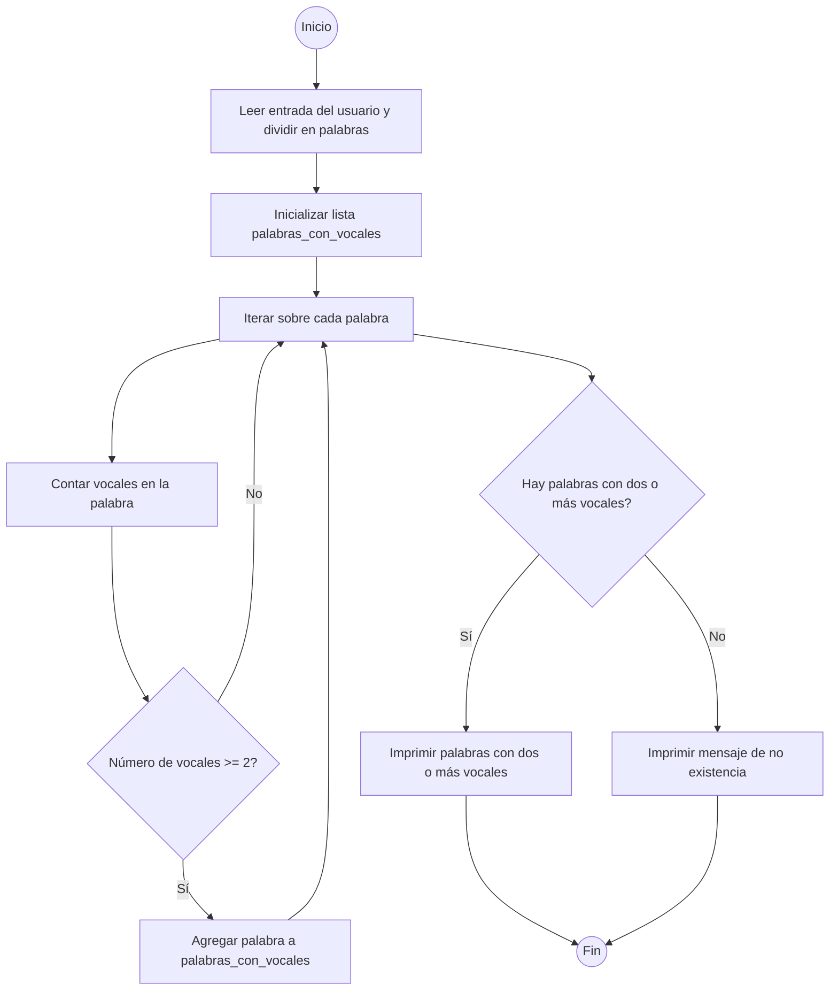

```ruby
if __name__ == "__main__":
    # Solicita al usuario que ingrese palabras separadas por espacios y las almacena en una lista
    palabras = input("Ingrese palabras separadas por espacio: ").split()

    # Lista para almacenar las palabras que contienen dos o más vocales
    palabras_con_vocales = []

    # Itera sobre cada palabra en la lista ingresada
    for palabra in palabras:
        # Cuenta las vocales en la palabra utilizando una comprensión de listas dentro de la función sum()
        if sum(1 for letra in palabra if letra in "aeiou") >= 2:
            # Si la palabra contiene dos o más vocales, se agrega a la lista palabras_con_vocales
            palabras_con_vocales.append(palabra)

    # Verifica si hay palabras con dos o más vocales en la lista
    if palabras_con_vocales:
        # Itera sobre la lista de palabras que cumplen con el criterio y las imprime
        for palabra in palabras_con_vocales:
            print(f"La palabra '{palabra}' tiene dos o más vocales.")
    else:
        # Si no hay palabras con dos o más vocales, imprime un mensaje indicando eso
        print("No existe una palabra con dos o más vocales.")

```

<details>
  <summary>Explicacion</summary>
  Entrada:

  Solicita al usuario que ingrese palabras.
  Usa split() para dividir la cadena en palabras individuales.
  Contar Vocales:

  Para cada palabra, cuenta cuántas letras son vocales.
  Utiliza una expresión para sumar la cantidad de vocales en cada palabra.
  Guardar y Mostrar Resultados:

  Si la palabra tiene al menos dos vocales, se agrega a una lista.
  Después, revisa si la lista de palabras con dos o más vocales tiene elementos.
  Imprime las palabras que tienen dos o más vocales o muestra un mensaje si no hay ninguna.
</details>


# 8
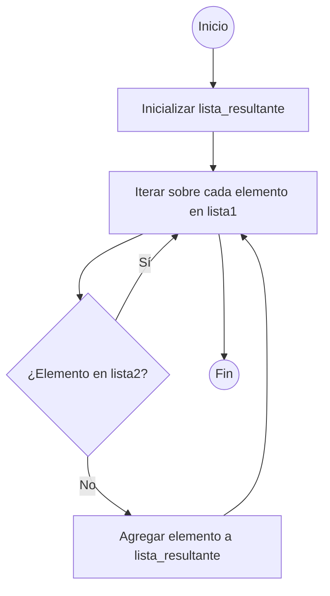

```ruby
def elementos_ausentes(lista1: list, lista2: list) -> list:
    """
    Encuentra y retorna los elementos que están en la primera lista pero no en la segunda.

    Parámetros:.
    lista1 (list): La primera lista de elementos.
    lista2 (list): La segunda lista de elementos.

    Retorna:
    list: Una lista con los elementos que están en lista1 pero no en lista2.
    """
    lista_resultante = []  # Lista para almacenar los elementos ausentes en lista2

    # Itera sobre cada elemento en lista1
    for i in lista1:
        # Verifica si el elemento no está en lista2
        if i not in lista2:
            # Si el elemento no está en lista2, se agrega a lista_resultante
            lista_resultante.append(i)
    
    return lista_resultante  # Retorna la lista de elementos ausentes

if __name__ == "__main__":
    # Inicializa listas vacías para almacenar los elementos ingresados por el usuario
    lista1 = []
    lista2 = []

    # Bucle para ingresar elementos en la primera lista
    while True:
        entrada = input("Ingresar elemento (escriba 'fin' para terminar): ")
        if entrada.lower() == "fin":  # Verifica si el usuario desea finalizar la entrada
            break
        lista1.append(entrada)  # Agrega el elemento a la primera lista
    
    # Bucle para ingresar elementos en la segunda lista
    while True:
        entrada2 = input("Ingresar elemento (escriba 'fin' para terminar): ")
        if entrada2.lower() == "fin":  # Verifica si el usuario desea finalizar la entrada
            break
        lista2.append(entrada2)  # Agrega el elemento a la segunda lista

    # Llama a la función para encontrar elementos ausentes y almacena el resultado
    lista_resultante = elementos_ausentes(lista1, lista2)
    
    # Imprime los elementos que están en lista1 pero no en lista2
    print(f"Los elementos que tiene la primera lista que no tiene la segunda son: {lista_resultante}")

```
<details>
  <summary>explicacion</summary>
  
  Definición de la función: Se define una función llamada elementos_ausentes que toma dos listas (lista1 y lista2) como parámetros y retorna una lista.
  
  Inicializar lista_resultante: Dentro de la función, se crea una lista vacía llamada lista_resultante. Esta lista se usará para almacenar los elementos que están en lista1 pero no en lista2.

  Iterar sobre lista1: Se utiliza un bucle for para iterar sobre cada elemento i en lista1.

  Verificar si el elemento está en lista2:

  Se verifica si el elemento i no está en lista2 usando el operador not in.
  Si el elemento i no está en lista2, se añade a lista_resultante con el método append().
  Retornar la lista_resultante: Después de que el bucle haya terminado de iterar sobre todos los elementos de lista1, la función retorna lista_resultante, que contiene todos los elementos que están en lista1      pero no en lista2.
</details>
  
# 9
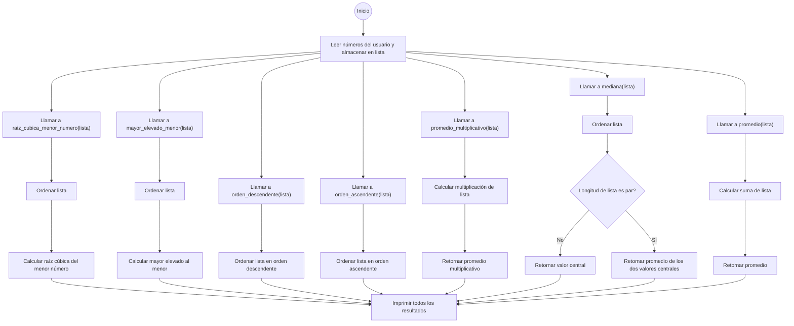

```ruby
def promedio(lista: list) -> float:
    """
    Calcula el promedio de una lista de números.

    Parámetros:
    lista (list): Una lista de números.

    Retorna:
    float: El promedio de los números en la lista.
    """
    suma = 0
    for i in lista:
        suma += i
    return suma / len(lista)

def mediana(lista: list) -> float:
    """
    Calcula la mediana de una lista de números.

    Parámetros:
    lista (list): Una lista de números.

    Retorna:
    float: La mediana de los números en la lista.
    """
    lista.sort()
    n = len(lista)
    if n % 2 == 0:
        # Si la longitud es par, retorna el promedio de los dos valores centrales
        return (lista[n // 2 - 1] + lista[n // 2]) / 2
    else:
        # Si la longitud es impar, retorna el valor central
        return lista[n // 2]

def promedio_multiplicativo(lista: list) -> float:
    """
    Calcula el promedio multiplicativo de una lista de números.

    Parámetros:
    lista (list): Una lista de números.

    Retorna:
    float: El promedio multiplicativo de los números en la lista.
    """
    multiplicacion = 1
    for i in lista:
        multiplicacion *= i
    return multiplicacion ** (1 / len(lista))

def orden_ascendente(lista: list) -> list:
    """
    Ordena una lista de números en orden ascendente.

    Parámetros:
    lista (list): Una lista de números.

    Retorna:
    list: La lista ordenada de forma ascendente.
    """
    lista.sort()
    return lista

def orden_descendente(lista: list) -> list:
    """
    Ordena una lista de números en orden descendente.

    Parámetros:
    lista (list): Una lista de números.

    Retorna:
    list: La lista ordenada de forma descendente.
    """
    lista.sort(reverse=True)
    return lista

def mayor_elevado_menor(lista: list) -> float:
    """
    Calcula el valor del mayor número elevado a la potencia del menor número de la lista.

    Parámetros:
    lista (list): Una lista de números.

    Retorna:
    float: El mayor número elevado al menor número.
    """
    lista.sort()
    return lista[-1] ** lista[0]

def raiz_cubica_menor_numero(lista: list) -> float:
    """
    Calcula la raíz cúbica del menor número en la lista.

    Parámetros:
    lista (list): Una lista de números.

    Retorna:
    float: La raíz cúbica del menor número en la lista.
    """
    lista.sort()
    return lista[0] ** (1 / 3)

if __name__ == "__main__":
    # Solicita al usuario que ingrese números para formar una lista
    print("Ingrese los números de la lista. Para terminar, ingrese 'fin'.")
    lista = []
    while True:
        entrada = input("Ingresar número: ")
        if entrada.lower() == "fin":  # Verifica si el usuario desea finalizar la entrada
            break
        lista.append(float(entrada))  # Convierte la entrada a float y la agrega a la lista

    # Calcula y almacena los resultados de varias funciones estadísticas y de manipulación de listas
    resultado_promedio = promedio(lista)
    resultado_mediana = mediana(lista)
    resultado_promedio_multiplicativo = promedio_multiplicativo(lista)
    resultado_orden_ascendente = orden_ascendente(lista)
    resultado_orden_descendente = orden_descendente(lista)
    resultado_mayor_elevado_menor = mayor_elevado_menor(lista)
    resultado_raiz_cubica_menor_numero = raiz_cubica_menor_numero(lista)
    
    # Imprime los resultados obtenidos
    print(f"El promedio es {resultado_promedio}")
    print(f"La mediana es {resultado_mediana}")
    print(f"El promedio multiplicativo es {resultado_promedio_multiplicativo}")
    print(f"La lista ordenada de forma ascendente es {resultado_orden_ascendente}")
    print(f"La lista ordenada de forma descendente es {resultado_orden_descendente}")
    print(f"El mayor elevado al menor es {resultado_mayor_elevado_menor}")
    print(f"La raíz cúbica del menor número es {resultado_raiz_cubica_menor_numero}")

```


<details>
  <summary>Explicacion</summary>
  1. Funcion del promedio 
  Proceso:
  Inicializa una variable suma en 0.
  Recorre cada número en la lista, sumando cada uno a suma.
  Divide la suma total por el número de elementos en la lista (len(lista)) para obtener el promedio.
  Retorno: El promedio de los números en la lista.

  2. Funcion de la mediana
  Proceso:
  Inicializa una variable suma en 0.
  Recorre cada número en la lista, sumando cada uno a suma.
  Divide la suma total por el número de elementos en la lista (len(lista)) para obtener el promedio.
  Retorno: El promedio de los números en la lista.  

  3. Fundion del promedio multiplicativo
  Proceso:
  Inicializa multiplicacion en 1.
  Multiplica todos los números en la lista.
  Calcula la raíz n-ésima (donde n es el número de elementos en la lista) del producto total.
  Retorno: El promedio multiplicativo de los números en la lista.

  4. Funcion para ordenar acendentemente
  Proceso: Ordena la lista usando el método sort().
  Retorno: La lista ordenada de forma ascendente. xd

  5. Funcion para ordenar descendentemente
  Ordena la lista en orden descendente usando el método sort(reverse=True).
  Retorno: La lista ordenada de forma descendente.

  6. Funcion del mayor numero elevado al menor
  Proceso:
  Ordena la lista.
  Toma el mayor número (lista[-1]) y lo eleva a la potencia del menor número (lista[0]).
  Retorno: El resultado de elevar el mayor número a la potencia del menor número.

  7. Funcion de la raiz cubica del menor numero
  Proceso:
  Ordena la lista.
  Toma el menor número (lista[0]) y calcula su raíz cúbica.
  Retorno: La raíz cúbica del menor número en la lista.

</details>

# 10 

# Usando la compresion de listas
```ruby
def multiplos_de_tres(lista: list) -> list:
    """
    Filtra y retorna los números de la lista que son múltiplos de 3.

    Parámetros:
    lista (list): Una lista de números.

    Retorna:
    list: Una lista con los números de la lista original que son múltiplos de 3.
    """
    # Utiliza una comprensión de listas para filtrar los números que son múltiplos de 3
    return [multiplo for multiplo in lista if multiplo % 3 == 0]

if __name__ == "__main__":
    # Solicita al usuario que ingrese números para formar una lista
    print("Ingrese los números de la lista. Para terminar, ingrese 'fin'.")
    lista = []

    while True:
        entrada = input("Ingresar número: ")
        if entrada.lower() == "fin":  # Verifica si el usuario desea finalizar la entrada
            break
        try:
            # Convierte la entrada a float y la agrega a la lista
            lista.append(float(entrada))
        except ValueError:
            # Maneja entradas no válidas que no se pueden convertir a float
            print("Por favor, ingrese un número válido o 'fin' para terminar.")
    
    # Llama a la función para obtener los múltiplos de 3 y almacena el resultado
    resultado_multiplos = multiplos_de_tres(lista)
    
    # Imprime los números que son múltiplos de 3
    print(f"Los números múltiplos de 3 de la lista son: {resultado_multiplos}")
```
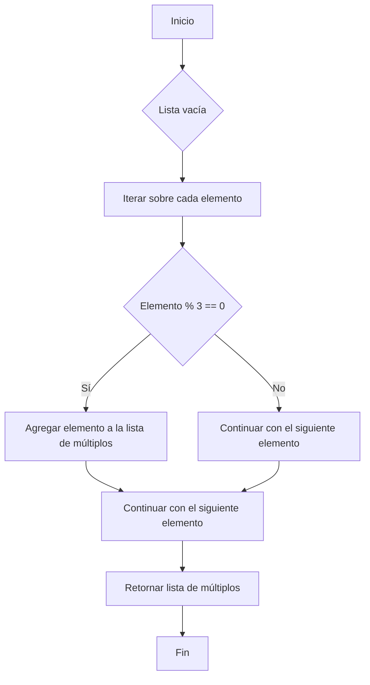
<details>
  <summary>Explicacion</summary>
  Método: Utiliza una comprensión de listas para filtrar los números:

  Comprensión de Listas: Es una manera concisa de crear una nueva lista aplicando una condición. En este caso, la condición es que el número debe ser divisible por 3 (multiplo % 3 == 0).
  Proceso:

  Recorre cada número en la lista original.
  Verifica si el número es divisible por 3.
  Incluye el número en la nueva lista si cumple la condición.
</details>


# Acumulando en una lista
```ruby
def multiplos_de_tres(lista: list) -> list:
    """
    Filtra y retorna los números de la lista que son múltiplos de 3.

    Parámetros:
    lista (list): Una lista de números.

    Retorna:
    list: Una lista con los números de la lista original que son múltiplos de 3.
    """
    multiplos = []  # Lista para almacenar los múltiplos de 3

    # Itera sobre cada número en la lista
    for i in lista:
        # Verifica si el número es múltiplo de 3
        if i % 3 == 0:
            multiplos.append(i)  # Agrega el número a la lista de múltiplos si cumple la condición
    
    return multiplos  # Retorna la lista de múltiplos de 3

if __name__ == "__main__":
    # Solicita al usuario que ingrese números para formar una lista
    print("Ingrese los números de la lista. Para terminar, ingrese 'fin'.")
    lista = []

    while True:
        entrada = input("Ingresar número: ")
        if entrada.lower() == "fin":  # Verifica si el usuario desea finalizar la entrada
            break
        try:
            # Convierte la entrada a float y la agrega a la lista
            lista.append(float(entrada))
        except ValueError:
            # Maneja entradas no válidas que no se pueden convertir a float
            print("Por favor, ingrese un número válido o 'fin' para terminar.")
    
    # Llama a la función para obtener los múltiplos de 3 y almacena el resultado
    resultado_multiplos = multiplos_de_tres(lista)
    
    # Imprime los números que son múltiplos de 3
    print(f"Los números múltiplos de 3 de la lista son: {resultado_multiplos}")
```
# es basicamente el mismo codigo anterior pero sin usar la compresion de listas
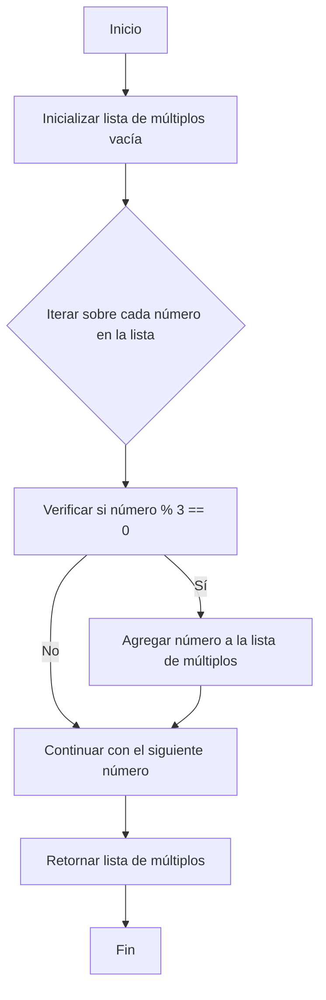
<details>
  <summary>Explicacion</summary>
  Inicializa una lista vacía multiplos para almacenar los múltiplos de 3.
  Recorre cada número en lista.
  Para cada número, verifica si es divisible por 3 (i % 3 == 0).
  Si el número es múltiplo de 3, lo agrega a la lista multiplos.
  Al final, devuelve la lista multiplos.
</details>


# Sin utilizar el modulo "%"
```ruby
def multiplos_de_tres(lista: list) -> list:
    """
    Filtra y retorna los números de la lista que son múltiplos de 3.

    Parámetros:
    lista (list): Una lista de números.

    Retorna:
    list: Una lista con los números de la lista original que son múltiplos de 3.
    """
    multiplos = []  # Lista para almacenar los múltiplos de 3
    
    # Itera sobre cada número en la lista
    for i in lista:
        suma = 0  # Inicializa la variable suma para verificar múltiplos de 3
        while suma <= i:  # Recorre múltiplos de 3 hasta alcanzar o superar el número i
            if suma == i and suma != 0:  # Si suma es igual a i y no es 0
                multiplos.append(i)  # Agrega i a la lista de múltiplos
                break  # Sale del bucle mientras, ya que encontramos el múltiplo
            suma += 3  # Incrementa suma en 3 para verificar el siguiente múltiplo
    
    return multiplos  # Retorna la lista de múltiplos de 3

if __name__ == "__main__":
    # Solicita al usuario que ingrese números para formar una lista
    print("Ingrese los números de la lista. Para terminar, ingrese 'fin'.")
    lista = []

    while True:
        entrada = input("Ingresar número: ")
        if entrada.lower() == "fin":  # Verifica si el usuario desea finalizar la entrada
            break
        try:
            # Convierte la entrada a float y la agrega a la lista
            lista.append(float(entrada))
        except ValueError:
            # Maneja entradas no válidas que no se pueden convertir a float
            print("Por favor, ingrese un número válido o 'fin' para terminar.")
    
    # Llama a la función para obtener los múltiplos de 3 y almacena el resultado
    resultado_multiplos = multiplos_de_tres(lista)
    
    # Imprime los números que son múltiplos de 3
    print(f"Los números múltiplos de 3 de la lista son: {resultado_multiplos}")

```
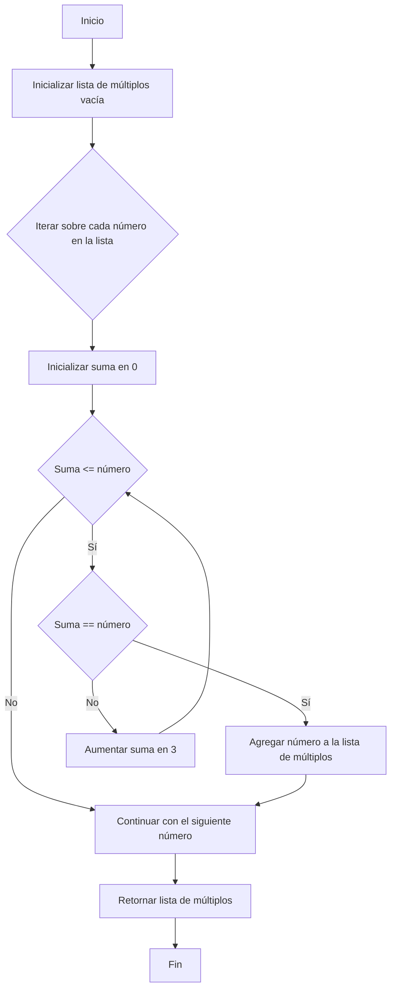

<details>
  <summary>Explicacion</summary>
  Inicializa una lista vacía multiplos para almacenar los múltiplos de 3.
  Recorre cada número en la lista.
  Para cada número i, verifica si es múltiplo de 3 usando un bucle while:
  Inicializa suma en 0. Esta variable se usa para iterar sobre los múltiplos de 3.
  En cada iteración del bucle while, incrementa suma en 3.
  Si suma iguala a i y suma no es 0, i es múltiplo de 3, por lo que se agrega a la lista multiplos y se sale del bucle.
  Si el bucle termina sin encontrar que i sea múltiplo de 3, se continúa con el siguiente número en la lista.
  Finalmente, retorna la lista multiplos.
</details>


# 11
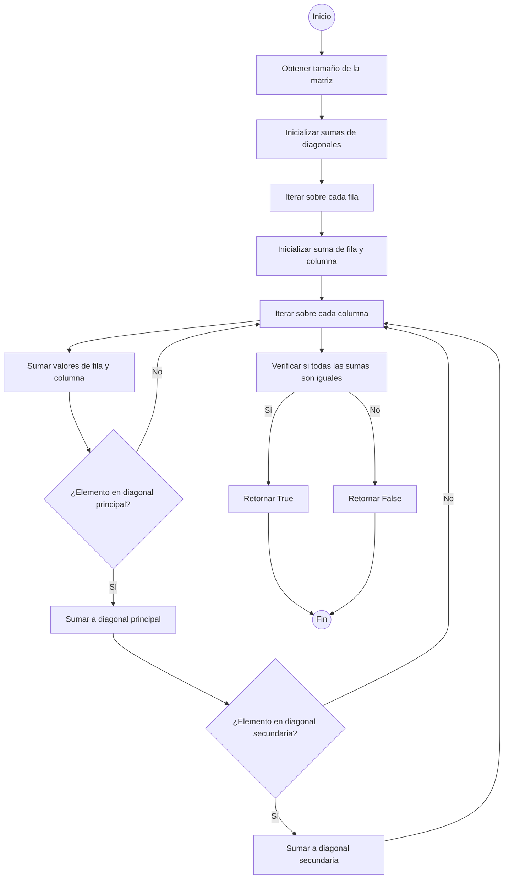

```ruby
def matriz_magica(matriz: list) -> bool:
    """
    Verifica si una matriz cuadrada es mágica. Una matriz es mágica si la suma de los números
    en cada fila, cada columna y ambas diagonales principales es la misma.

    Parámetros:
    matriz (list): Una lista de listas que representa una matriz cuadrada.

    Retorna:
    bool: True si la matriz es mágica, False en caso contrario.
    """
    dimensiones = len(matriz)  # Obtiene el tamaño de la matriz
    suma_diagonal_principal = 0  # Inicializa la suma de la diagonal principal
    suma_diagonal_secundaria = 0  # Inicializa la suma de la diagonal secundaria

    # Itera sobre cada fila
    for i in range(dimensiones):
        suma_filas = 0  # Inicializa la suma de la fila actual
        suma_columnas = 0  # Inicializa la suma de la columna actual

        # Itera sobre cada columna
        for j in range(dimensiones):
            suma_filas += matriz[i][j]  # Suma el valor de la fila actual
            suma_columnas += matriz[j][i]  # Suma el valor de la columna actual

            # Verifica si el elemento está en la diagonal principal
            if i == j:
                suma_diagonal_principal += matriz[i][j]
            # Verifica si el elemento está en la diagonal secundaria
            if i + j == dimensiones - 1:
                suma_diagonal_secundaria += matriz[i][j]

    # Tomamos la suma de la primera fila como referencia
    suma_esperada = suma_filas  

    # Verifica si todas las sumas son iguales
    if (suma_filas != suma_columnas or
        suma_filas != suma_diagonal_principal or
        suma_filas != suma_diagonal_secundaria or
        suma_columnas != suma_diagonal_principal or
        suma_columnas != suma_diagonal_secundaria or
        suma_diagonal_principal != suma_diagonal_secundaria):
        return False

    return True

if __name__ == "__main__":
    print("¿Su matriz es mágica?")
    dimensiones = int(input("Ingrese el número de filas y columnas de la matriz: "))
    matriz = []

    # Lee la matriz del usuario
    for j in range(dimensiones):
        fila = []
        for k in range(dimensiones):
            valor = int(input(f"Ingrese el valor para [{j+1}], [{k+1}] de la matriz: "))
            fila.append(valor)
        matriz.append(fila)

    # Verifica si la matriz es mágica
    resultado_matriz_magica = matriz_magica(matriz)

    if resultado_matriz_magica:
        # Calcula la suma esperada basada en la primera fila
        print(f"La matriz es mágica pues la suma de todas sus filas, columnas y diagonales es {sum(matriz[0])}")
    else:
        print("La matriz no es mágica")

```

<details>
  <summary>Explicacion</summary>
  Este código determina si una matriz cuadrada es mágica. Una matriz se considera mágica si la suma de los números en cada fila, cada columna y ambas diagonales principales son iguales.

Inicialización:

Se obtiene el tamaño de la matriz (dimensiones) y se inicializan las sumas para la diagonal principal y secundaria.
Cálculo de sumas:

Se itera sobre cada fila y cada columna de la matriz, sumando los valores en la fila y la columna correspondientes.
Se actualizan las sumas de las diagonales si el valor actual está en la diagonal principal o secundaria.
Verificación de magia:

Se toma la suma de la primera fila como referencia (suma_esperada).
Se comparan las sumas obtenidas de las filas, columnas, y diagonales para verificar si todas son iguales.
Si todas las sumas son iguales, la matriz es mágica; de lo contrario, no lo es.
Interacción con el usuario:

El usuario ingresa el tamaño de la matriz y sus elementos.
La función matriz_magica verifica si la matriz es mágica y muestra el resultado.
</details>
